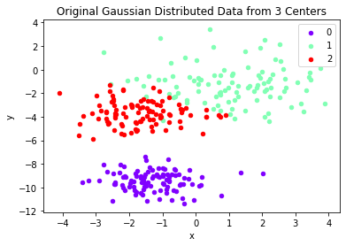
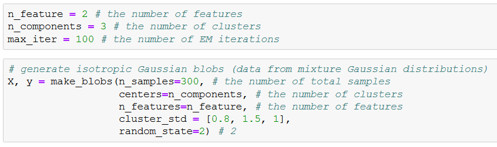
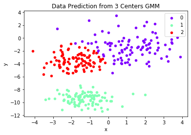
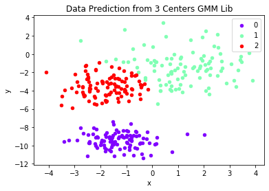
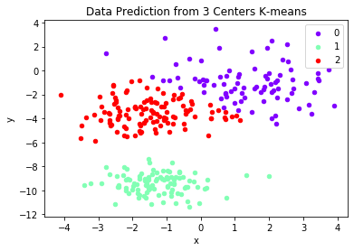

# Gaussian Mixture Models with Expectation-Maximization Algorithm Implementation from Scratch in PySpark

This is a PySpark project which implements GMM with EM from scratch to cluster mixed Guassian blobs.

#### Author: Yi Rong

#### Date: 05/03/2021

---

# Data Description

## Code Description

GMM_EM_Pyspark_Product.ipynb: 

* GMM with EM implemented from scratch
* GMM with EM implemented from library
* K-means implemented from library

## Model Prediction

▶ Visualization

▶ Log-likelihood

* In GMM library implementation, GMM’s log-likelihood is maximized to -1200.238

* In implementation from scratch, GMM’s log-likelihood is maximized to -1200.258

▶ Accuracy

|           | GMM from scratch  | GMM Lib  | K-means |
|-----------|-------------------|----------|---------|
| Accuracy  | 95.3%             | 95.0%    | 94.3%   |

# Other Documents. 

* docs/CS777_Presentation_Rong.docx: Presentation Slides

# How to run  

Open GMM_EM_Pyspark_Product.ipynb with Jupyter Notebook

